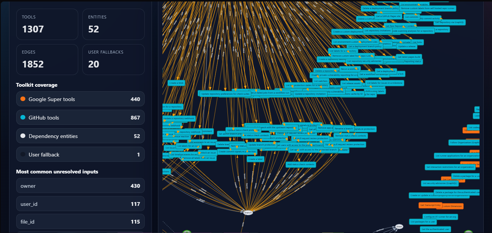

# Composio Dependency Graph

**O que faz:** lê as 1.307 ferramentas dos toolkits **GitHub** e **Google Super** da Composio e gera um mapa visual de quais valores cada ferramenta precisa receber, quais produz, e quais nunca aparecem como saída de nenhuma ferramenta (ou seja, sempre vêm do usuário).

**Por que existe:** desafio técnico do processo seletivo da Composio (task `dep`).



> No print acima, o nó central `branch` está cercado pelas dezenas de ferramentas GitHub que pedem esse valor. Lendo o painel da esquerda em um piscar: 1.307 ferramentas, 52 entidades canônicas, 1.852 conexões, **20 valores que sempre vêm do usuário** (com `owner` no topo, exigido por 430 ferramentas).

---

## Exemplo concreto

Quero criar uma issue no GitHub. A ferramenta `GITHUB_CREATE_ISSUE` exige `owner`, `repo`, `title`, `body`. Abrindo o grafo:

- `repo` → **várias ferramentas produzem** esse valor (listar repositórios, buscar repos por nome, etc.). Posso encadear.
- `owner` → **nenhuma ferramenta produz**. Tem que vir do usuário.
- `title`, `body` → texto livre, sempre vêm do usuário (são filtrados do grafo por isso).

Em uma linha: *para automatizar essa ação, basta perguntar ao usuário o `owner` — o resto pode ser descoberto.* É esse tipo de resposta que o grafo dá em um clique.

---

## Resultado

| Métrica                              | Valor |
| ------------------------------------ | ----- |
| Ferramentas analisadas               | 1.307 |
| GitHub                               | 867   |
| Google Super                         | 440   |
| Entidades canônicas (vocabulário)    | 52    |
| Relações mapeadas                    | 1.852 |
| Valores que sempre vêm do usuário    | 20    |

**Top 5 valores que sempre vêm do usuário** (nenhuma ferramenta produz):

| Valor      | Ferramentas que pedem |
| ---------- | --------------------- |
| `owner`    | 430 |
| `user_id`  | 117 |
| `file_id`  | 115 |
| `sheet_id` | 82  |
| `team_id`  | 59  |

---

## Como rodar

```bash
cp .env.example .env       # cole sua COMPOSIO_API_KEY
python src/build_dependency_graph.py
# abre o arquivo gerado:
start dependency_graph.html
```

Python 3.10+. **Zero dependências externas** — só stdlib.

---

## Como funciona

A entrada são os schemas JSON de cada ferramenta da Composio (`input_parameters` e `output_parameters`). A saída são dois arquivos: `dependency_graph.json` (dados) e `dependency_graph.html` (visualização interativa standalone, sem servidor).

O passo não‑óbvio no meio é a **normalização de nomes**. Os schemas usam vários sinônimos para o mesmo conceito — `repo`, `repository`, `repository_name`, `repo_full_name` são todos a mesma coisa. Se eu ligasse ferramentas diretamente comparando nomes de campo, o grafo virava ruído. Em vez disso, cada campo passa por uma função que tenta mapear para um vocabulário fixo de ~24 "entidades canônicas" (`repo`, `owner`, `commit_sha`, `thread_id`, etc.). As ferramentas só se conectam *através* dessas entidades.

```
ferramenta A ──produz──▶  repo  ──consumido por──▶  ferramenta B
                           ▲
                           │ (quando ninguém produz, vem do usuário)
                           │
                         usuário
```

A inferência é heurística — aliases diretos (`repository_name → repo`), regex sobre nome/descrição, casamento por sufixo (`<base>_id`), e fallback usando o contexto da ferramenta. Está concentrada em `infer_entity_name` em [src/build_dependency_graph.py](src/build_dependency_graph.py) e foi a parte que mais tempo levou pra acertar.

Campos que são entrada humana por natureza (`title`, `body`, `query`, `page`, `limit`...) são filtrados antes do desenho das arestas — não faz sentido perguntar "qual ferramenta produz `title`?".

---

## Decisões de design

**Bipartido em vez de tool‑to‑tool.** Foi a decisão mais importante. A primeira versão (em TypeScript, descartada) ligava ferramentas diretamente comparando nomes de campos de entrada com nomes de campos de saída. Como campos genéricos como `name`, `id`, `type` aparecem em ferramentas que não têm relação semântica, o resultado foi um grafo praticamente aleatório. Introduzir a camada de entidade canônica reduziu o grafo ao que importa.

**Stdlib only.** Sem `requests`, sem `pydantic`. O ponto principal é a inferência de entidades, não a engenharia em volta — `urllib` + `dataclasses` resolvem. Quem clona o repo roda na hora, sem `pip install`.

**HTML auto‑contido.** A visualização inlina o grafo no próprio `.html`. Não é a forma mais eficiente para iterar UI, mas é um único arquivo que abre direto do disco — portável como entregável.

**Recall sobre precisão na detecção de produtores.** Se um campo canônico aparece em qualquer lugar do schema de saída, a ferramenta é marcada como produtora. Gera falsos positivos visíveis, mas evita esconder caminhos válidos.

---

## Limitações conhecidas

- **`owner` no topo do ranking de "não resolvidos"** é esperado — é parte da identidade da requisição no GitHub, não algo que se "produz". Tratá‑lo como input do usuário está certo, só fica contra‑intuitivo no gráfico.
- **Entradas opcionais são ignoradas.** O código só amarra dependências marcadas como `required: true`.
- **`confidence` é calculado mas não usado para filtrar.** Cada inferência tem um score de 0–1 que seria a base natural para um slider na UI.
- **Vocabulário canônico é fixo.** Estender pra um terceiro toolkit (Slack, Notion) exige editar a lista à mão.

---

## O que faria com mais tempo

- **Separar JSON do HTML.** Hoje os dados estão inline no `.html`. O viewer deveria carregar via `fetch('dependency_graph.json')` para iterar UI sem regerar o arquivo inteiro.
- **Busca de caminhos na UI.** O grafo já tem a informação para responder "dado `GITHUB_MERGE_PULL_REQUEST`, qual a cadeia mínima de ferramentas que produzem cada parâmetro?". Faltou tempo pra colocar essa busca no front.
- **Slider de confidence** para o usuário ajustar o ponto de corte.
- **Generalizar.** Os toolkits estão hardcoded em uma constante. Aceitar via CLI abriria o pipeline para qualquer combinação.
- **Testes da inferência canônica.** A função `infer_entity_name` é puramente data‑driven (entrada: nome + descrição + contexto; saída: string ou None) e se beneficiaria de uma suíte de casos.

---

## Estrutura

```
composio-dependency-graph/
├── README.md
├── .env.example
├── .gitignore
├── src/
│   └── build_dependency_graph.py   # pipeline canônico (~1000 linhas, stdlib pura)
├── dependency_graph.json           # gerado
└── dependency_graph.html           # gerado, auto-contido
```
